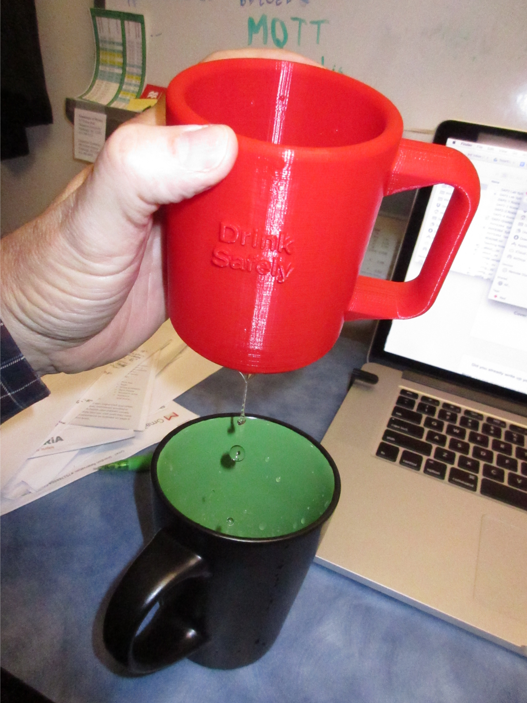

# The Drink Safely Cup
## Designed by profhuster @ gmail.com
## April 2017
This is a dribble cup designed in response to the Make Magazine _worst 
cup_ challenge.

If you hold the handle with your right hand 
and drink out of the cup, it will dribble until empty. If you use 
Your left hand or face the cup in another direction (not looking at 
the "Drink Safely" label) you can drink out of it with out dribbling. 

### A Print of the cup with OpenScad image in background.
---

### When dribbling, the fluid leaks through this text.
---

### The cup completely empties once it starts.
(Sorry I can't get the image rotated correctly.)
---

## The Physics of the Cup
There is a siphon hidden inside the wall of the cup. The inlet to the 
siphon is at the bottom inside the cup. It is very hard to see, even 
if you are looking for it. The vertical siphon tubes run up to the lip 
behind the label "Drink Safely." Once the fluid level reaches the top 
of the siphon tube, water fills the tube starting a siphon. Once the 
siphon starts, it won't stop until the entire cup is drained. The physics 
is like a traditional toilet bowl; the bowl fills until the siphon is 
full, then the bowl drains until air is sucked into the siphon ending 
the process.

The drain is concealed in the indented text on the bottom of the cup, 
so you can't tell that there is a connection to the siphon tube or 
anything fishy.
Some of the letters near the edge are connect to the siphon drain, so 
fluid dribbles from the letters themselves.

I like the design. The insidious nature of the cup is very well 
concealed. 

I built the cup using an OpenSCAD parameter of $fn=96 to make the 
curves smooth.

There are other options in the OpenSCAD code. I try to put all of the 
parameters at the top of the file, so they are easy to change. 
